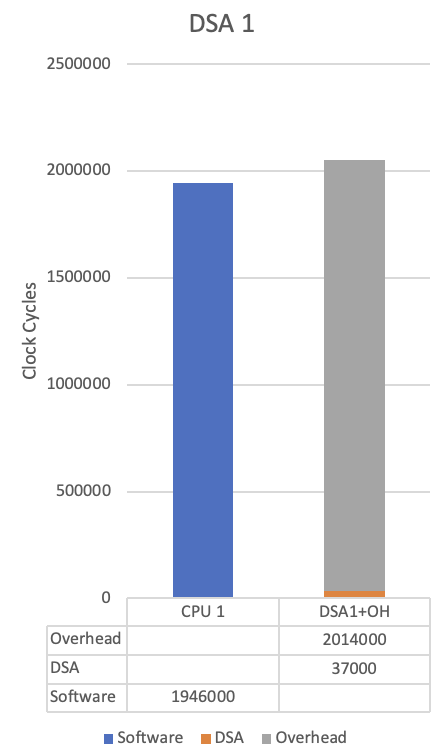
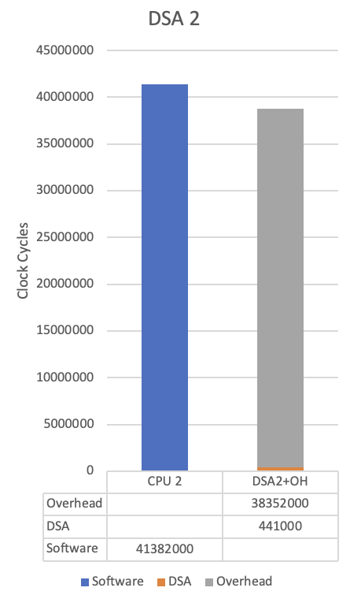
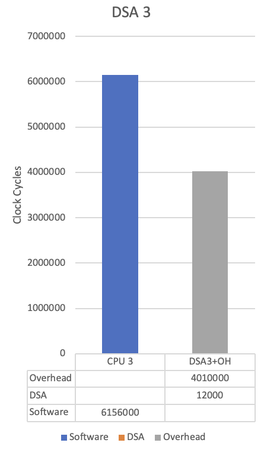
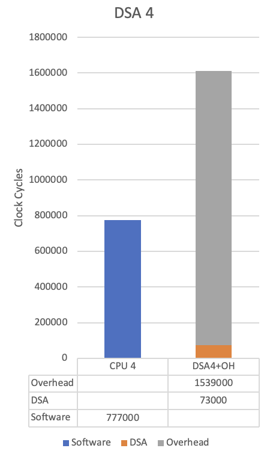
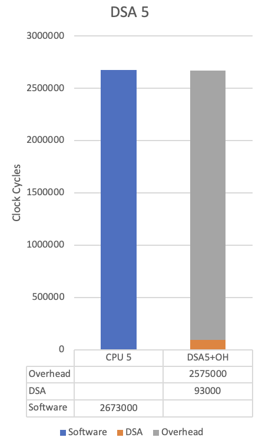
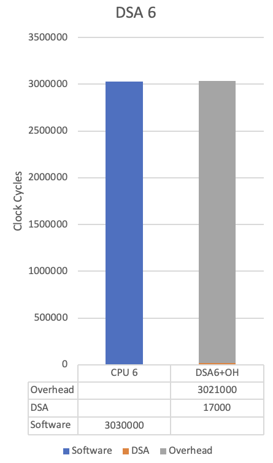

# Case Studies
To demonstrate the use of **D2** and its ease of setup, we used the MiBench benchmark suite [@guthaus01_mibench] since it is popular and features several workloads that are popular in the embedded systems computing space. The MiBench suite is split into six main groups, of the six, we considered `automotive` and `consumer`. Each of those groups has four or five applications, or workloads, ranging from bit manipulation to edge identification in an image. We ran **D2** on the full suite of workloads but because of the wide spectrum and diversity of algorithms implemented, there was minimal opportunity for DSA to be shared amongst the different workloads. There were, however, multiple instances of an SB being shared in multiple places within a given workload that **D2** was able to identify because of the normalization step. Using **D2**, we were able to identify multiple DSAs, six of which we will highlight here since they were ranked high by the **D2** tool.   

Although the tool successfully identified DSAs that significantly sped up the computations in the workloads, the communication between the DSA and the host remained a bottleneck in our case studies. Depending on the interface that is used between the host and the DSA---CPU and FPGA, in our experiments---the overhead of communicating between the host and DSA may be too large to overcome for small accelerators. The most straightforward implementation is to memory map the FPGA\'s input, output, and control registers into the global memory space of the CPU. This option also has the highest overhead to overcome. **D2** has the promise of mitigating this overhead using the superblock granularity for generating DSAs. In our analysis for this paper, we modeled the simple memory-mapped register interface since optimizing the communication interface is outside the scope of this work. While this approach suffices for demonstrating **D2**\'s utility; we note that even better results can be achieved using a higher-performing DMA (Direct Memory Access) or other vendor-specific communication interface between the host and DSA.
For each of the DSAs below, we used the gem5 [@binkert11_gem5] simulator to calculate the cycle counts of both the original un-accelerated code, as well as the accelerated code with the simulated CPU/FPGA interface. The cycle counts of the actual DSA are from the Vivado simulation with a 100MHz clock; and the host ARM CPU runs at 1GHz. We included the overhead of calling the accelerator from the host, demonstrating the bottleneck of the CPU/DSA interface.

## DSA 1
The first DSA we will look at was normalized from 4 different SBs. Via the normalization process, as detailed above, we were able to create a DSA that accepted arguments (data) that were passed into the DSA some of which were constants in the original code; in this instance, c1 and c2.
```c
int acc1(int c1, int Q00, int c2, int Qs, int Al)
{
  int pred;
  int num = c1 * Q00 * c2;
  if (num >= 0) {
    pred = (int) (((Qs<<7)+num) / (Qs<<8));
    if (Al>0 && pred>=(1<<Al))
      pred = (1<<Al)-1;
  } else {
    pred = (int) (((Qs<<7)-num) / (Qs<<8));
    if (Al>0 && pred>=(1<<Al))
      pred = (1<<Al)-1;
    pred = -pred;
  }
  return pred;
}
```
While the DSA is used only by a single workload, the normalization allowed us to reuse the DSA in four separate instances of the original code. Additional arguments were passed into the accelerator to accommodate the normalization. Unfortunately, while the cycle count is significantly lower than the software version, the overhead of the register interface is too large to overcome. In \autoref{fig:DSA1} we can see that the overhead of passing the arguments to the accelerator, and then fetching the results cost as much or more than doing the calculation on the CPU. If more efficient interface methods are available, more favorable numbers are obtainable.

{ width=35% }

## DSA 2
The second DSA is an example of a very complex function. It is, in fact, a stand-alone function in the original source code, but was identified as an SB by the **D2** software. It is part of the `automotive/basicmath` workload. The Vivado tool provided proprietary implementations of the math functions that are free to use on Xilinx FPGAs.
```c
#include <math.h>
void SolveCubic(double  a,
                double  b,
                double  c,
                double  d,
                int     *solutions,
                double  *x0, double *x1, double *x2)
{
  double a1 = b/a, a2 = c/a, a3 = d/a;
  double Q = (a1*a1 - 3.0*a2)/9.0;
  double R = (2.0*a1*a1*a1 - 9.0*a1*a2 + 27.0*a3)/54.0;
  double R2_Q3 = R*R - Q*Q*Q;
  double theta;
  if (R2_Q3 <= 0) {
    *solutions = 3;
    theta = acos(R/sqrt(Q*Q*Q));
    double sQ = sqrt(Q);
    *x0 = -2.0 * sQ * cos(theta/3.0) - a1/3.0;
    *x1 = -2.0 * sQ * cos((theta+2.0*M_PI)/3.0) - a1/3.0;
    *x2 = -2.0 * sQ * cos((theta+4.0*M_PI)/3.0) - a1/3.0;
  } else {
    *solutions = 1;
    *x0 = pow(sqrt(R2_Q3)+fabsl(R), 1/3.0);
    *x0 = *x0 +  Q / *x0;
    *x0 = *x0 * ((R < 0.0) ? 1 : -1);
    *x0 = *x0 - a1 / 3.0;
  }
}
```
Notice that the function makes several math function calls, which implies that each of them is also implemented by Vivado HLS into the FPGA accelerator. These were controlled by the constraints input file during the **D2** execution. The accelerator was able to achieve a significant amount of parallelism. In \autoref{fig:DSA2} we can see that the accelerator again provided a significant performance boost, but the overhead of passing arguments to the DSA via a memory-mapped interface is too much to overcome.

{ width=35% }

## DSA 3
The third DSA is an SB that was identified in multiple SBs from the `consumer/lame` workload. While it looks quite simple, it highlights the serialization that occurs in a CPU with a limited number of FP multiply units. This highlights an aspect of **D2** to find every possible SB and the power of normalization to identify where SBs are reused in multiple workloads. In \autoref{fig:DSA3} the table shows that the number of cycles to compute the result pales in comparison to the interface overhead.
```c
float acc3(float re, float im)
{
  return (re * re + im * im) * 0.5;
}
```
{ width=35% }

## DSA 4
The fourth DSA comes from multiple SBs, again in the `consumer/lame` workload. We expected this to do better. But on further inspection, we discovered the ARM CPU has a `sqrt` assembly language instruction. This points to the importance of understanding the target hardware and that many things need to be considered when attempting to map software to an accelerator. Contrast this DSA \autoref{fig:DSA4} with the next one that, in addition to the `sqrt` function, has other floating point operations.
```c
#include <math.h>

float acc4(float re, float im, float d)
{ 
  return sqrt(re*re+im*im)/d;
}
```
{ width=35% }

## DSA 5
Again this DSA \autoref{fig:DSA5} demonstrates that finding a granularity between a BB and full function can yield a DSA that can be used by multiple workloads and provide a significant performance boost to the overall computing task.
```c
#include <math.h>

float acc5(float an, float bn, float re, float im, float d)
{ 
  re = (an + bn) * 0.5 - re;
  im = (an - bn) * 0.5 - im;
  return sqrt(re*re + im*im) / d;
}
```
{ width=35% }

## DSA 6
This DSA \autoref{fig:DSA6} was not complex enough to overcome the overhead of our memory-mapped CPU/FPGA interface. It is a degenerate example of an SB that is, in fact, just a BB and demonstrates the need for the larger SB granularity.
```c
float acc6(float a, float b, float c, float d)
{
  return a * b * c / d;
}
```
{ width=35% }

# Conclusion
Our main intention has been to make the **D2** tool available as open source to the DSA community since the previous version of our lab\'s work was unavailable as OSS. We believe there is a future in right-sizing the DSA and that the **D2** tool can provide valuable input to that end. Because there are very few OSS tools geared towards the automation of DSA identification, we hope that the **D2** tool will be utilized and expanded upon within the computer architecture community to become a valuable resource and additionally, make the concept of the SB more accessible to the community as a whole. Our experiments have demonstrated the merit in the SB granularity, and providing the tool as OSS will assist in the adoption of the SB approach to designing DSAs. Furthermore, we hope that the community can collaboratively add more features to the tool to make it even more useful for designing DSAs for emerging computing systems.

# References
