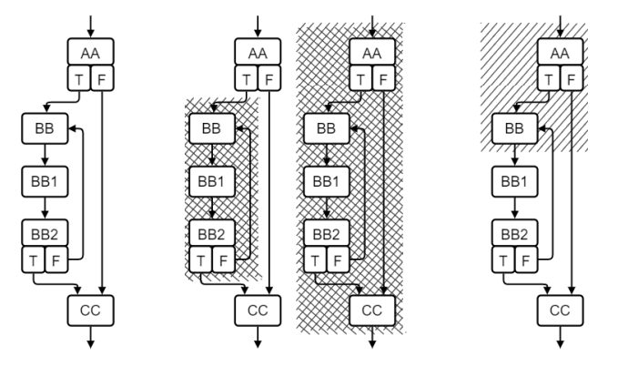
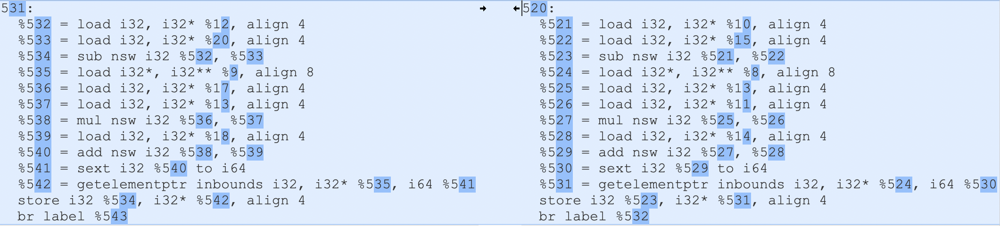
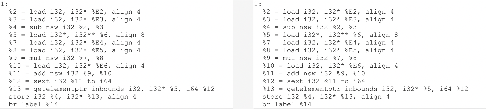
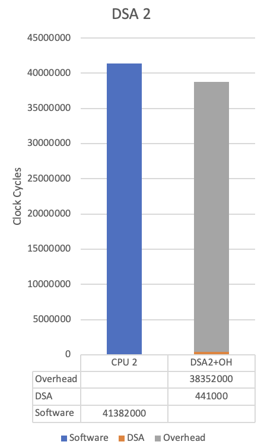
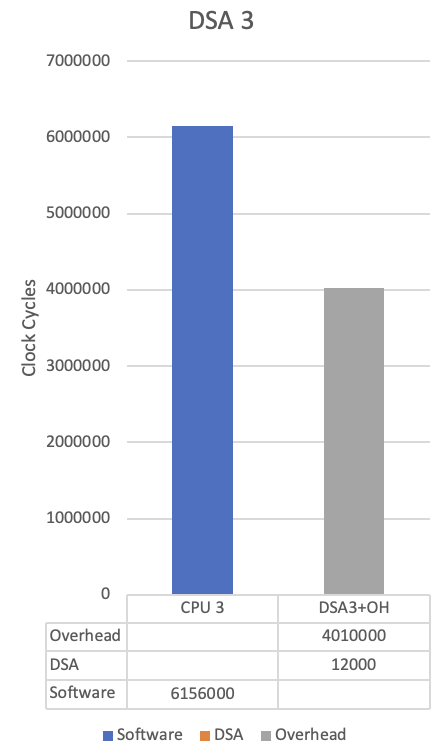
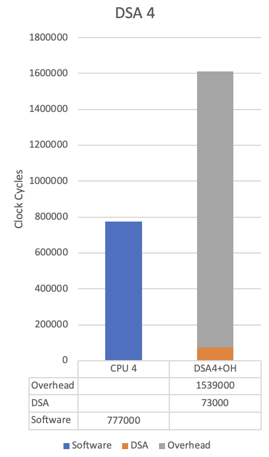

# Summary

Previous work [@limaye21_dosage] introduced the Super Block (SB) as a new granularity for designing Domain Specific Accelerators (DSAs). The SB provides a middle ground to the existing extreme granularities of creating DSAs only from Basic Blocks (BBs) or whole functions. This paper describes an Open Source Software (OSS), called **D2**, that implements the SB approach and will enable researchers and developers in the DSA community to easily experiment with this new granularity towards finding an optimal solution to the DSA definition at hand. Our results show that the SB should be taken seriously as a candidate for creating DSAs. A brief background is presented for readers new to the DSA arena.

# Statement of need

The DSA field currently offers few, if any, open-source automation tools. An important challenge in the design of DSAs is identifying what portions of a set of domain programs should be implemented in hardware (i.e., accelerated) to maximize the performance and energy benefits of the DSA. The SB as a new DSA granularity offers real benefits for efficiently addressing this challenge. However, manually identifying these SBs can be prohibitively time-consuming and error-prone. This ground-up re-write as open source from conception hopes to bring the SB construct to the community at large.

# Motivation for this work
In a post-Moore\'s Law computing environment where IoT and edge computing continue to expand, resource-constrained high-performance computing systems have become even more important. ASICs (application-specific integrated circuits) continue to set the performance bar, but bring along a high development cost, long lead times, and inability to make corrections or changes once manufactured; not to mention a threshold production run to where it even makes sense economically. GPUs solve the problem by throwing more, but cheaper computing power at a task. This requires a typically large parallelization design effort but in the end, the result is less than optimal from a power usage standpoint. When one of the goals is energy efficiency, GPUs fall short. Additionally, GPUs can be considered to be in the class of a general-purpose accelerator, which typically has a large area footprint and/or an underutilized compute resource that is prohibitive in a resource-constrained environment. Alternatively, a Domain Specific Accelerator (DSA) is an accelerator that is customized for common code blocks shared between multiple workloads. A key takeaway of the DSA is that it typically accelerates a smaller portion of the workload, but at higher utilization rates across workloads, resulting in higher performance of the overall system. While a DSA could be realized in an ASIC, we will assume for this paper that ASICs have already been ruled out due to earlier discussed issues. A DSA on a field-programmable gate array (FPGA) offers a good balance between the often conflicting requirements. The drawback to DSAs, and motivation for this work, is a higher effort in hardware/software co-design since the APIs must be tailored for each DSA. This paper introduces open-source automation tools that address this increased co-design effort.

DSAs, as opposed to general purpose architectures or ASICs, continue to be an attractive alternative because they offer a significant boost to performance without the expensive trade-offs and overhead that creating an ASIC or the size and power requirements of a higher performance general purpose CPU [@guo04_fpgaAdvantages]. However, designing DSAs raises new challenges. The need to analyze different workloads, identify similarities between them, generate accelerators, and then implement the accelerators into the current code base are all challenges that must be overcome and where an opportunity for automation exists. Few, if any, current design automation tools exist for this task.

Previous work has used either a function level [@canis13_legup] (coarse) or a basic block (BB) [@kumar17_needle], which is much finer, as the division point between the CPU and accelerator. A BB is a division, by the compiler, of the source code that has a single entry point and a single exit point. A BB can be comprised of a single statement (of the high-level language) or multiple statements depending on the generated instruction flow of the compiled code. While the BB granularity would seem like the best fit for identifying and generating DSAs, [@limaye21_dosage] found that they were prohibitively overhead-prone due to the large number and small size of generated accelerators. Thus, they introduced a new granularity called the _superblock_. A superblock (SB) is a collection of BBs, from a control flow graph (CFG) perspective, that also has a single entry point and a single exit point 

The following \autoref{fig:cfg} illustrates the valid SB boundaries. The one-in, one-out aspect is key to its implementation, as it enables programs to be analyzed as easily as BBs, but offers more flexibility and better efficiency in generating DSAs.

 { height=200pt }
 
This paper describes an open-source tool for identifying and generating DSAs given a set of input workloads. We describe how it can be used to identify good candidates for acceleration at the SB granularity in a resource-constrained target, no matter what domain the application lives in. While we use FPGAs for our case study, the concept of implementing a DSA from SBs transfers well to other DSA implementation technologies.

# Background
## Domain-specific accelerators
Not unlike an ASIC, FPGAs usually require a designer who understands the constraints they operate under. However, FPGAs offer greater flexibility. It is in this vein that we then strive to measure the trade-offs in the granularity size of the DSA. When the DSA attempts to capture too much, it becomes a burden on the FPGA designer as the complexity increases. On the other end of the spectrum, creating a DSA from a single BB can introduce too much overhead in the interface between the CPU and the accelerator for the amount of work done by the accelerator. The SB concept provides a middle ground that may lead to an optimal acceleration solution. The **D2** tool provides an exhaustive list of SBs that can be simulated to determine the optimal size.

## Design automation of computer design
This is a follow-on work of [@limaye21_dosage] except re-engineered from the ground up, with special emphasis on making it open source. Additionally, the novel parts are:

 - user-controlled constraints
 - normalization of BBs
 - ranking at the BB level and then mapping the BB ranking onto SBs
 - maintaining a link back to the source so that the accelerators can be generated directly from the source code rather than the LLVM intermediate representation (IR) files


# D2 Overview
**D2**, as depicted in \autoref{fig:d2flow}, is a tool that accepts a system\'s tree of source code. The user makes minor modifications to the makefiles to generate the required LLVM IR files. **D2** then evaluates the IR files to create a set of metadata files. It then identifies and ranks BBs and SBs as candidates for FPGA acceleration to produce an optimal set of accelerators for the system. The identified source lines are then given to a synthesis tool, such as Xilinx Vivato HLS [@unspecified21_vivado_hls] to produce an FPGA accelerator that is integrated back into the source code. The resulting system runs faster and more efficiently, perhaps to the point that makes the system viable on a resource-constrained target, which without the DSA would not be achievable.

## Target system model
The target system model is assumed to be a resource-constrained computing system in which the generated DSA can be integrated. For example, this could be a CPU+FPGA system (used in our case studies), wherein the DSA is implemented on the FPGA, while the unaccelerated portions of the target workloads are run on the CPU. In this scenario, the FPGA should be addressable from the CPU such that the identified code that would normally be run by the CPU can be implemented on the FPGA and offloaded from the CPU without a significant bottleneck. This model is commonly found in resource-constrained computing devices where power constraints are a major concern. For example, human-implanted medical devices must be concerned with power and heat dissipation so that the surrounding tissues are not damaged [@karageorgos20_hwsw_bci].

## D2 workflow
The first step to using **D2** is to understand the system of applications build process. Typically, this is done via the `make` command which defines the compiler flags and dependencies required to build the set of applications or workloads. **D2** only needs to run the emit-llvm stage of the LLVM (clang) compiler, so the modifications required are minimal. However, starting with mature source that actually compiles and runs is assumed.
**D2** is a shell script that calls the individual programs written in both Python and C++ that process the LLVM files generated by the compiler.
It should be run from the top of the source tree (where one would type `make`) and passed as an argument to a destination directory where **D2** should store its output files.

## D2 implementation details
### The search for superblocks
The control flow graph (CFG) is easily generated from the LLVM IR [@ref22_llvmwebsiteintro] files. There are existing tools that do it, but we wrote our own to maintain control over the metadata kept within the CFG. We chose the standard Graphviz [@gansner17_graphviz] package to represent the CFG using their .dot file syntax. While the Graphviz package does support many graph manipulations and operations, superblock identification, as we have defined it, is not something it recognizes or manipulates. Therefore, we wrote our own application (sb.cc) that reads the .dot file and iteratively identifies every SB in the CFG file. This application is the heart of the overall **D2** package and a major contribution of this open-source effort. The `sb` application reads the CFG (.dot) file, within which each BB is represented as a node. Using the C++ Standard Template Library (STL) [@plauger00_c++stl], a map is constructed of each node with a vector of connected nodes. Once the graph is parsed into the map/tree, it recursively walks the tree identifying SBs by adding one adjacent node at a time and checking if the "One In, One Out" condition of an SB is satisfied. Once identified, the SB is added to a vector of SBs that is output and then ranked in a later stage.

### Identification of accelerator candidates
The key to achieving maximum acceleration is to choose areas of the software that are compute-bound. However, the most expensive compute operation can also be useless to accelerate if it is only executed once. Therefore, identifying and accelerating expensive compute operations that are done many times, typically, in a loop, will yield maximum overall acceleration. Further, if an accelerator can be used by multiple applications, the number of accelerators can be reduced. **D2** makes a concerted effort to identify common and frequently used code segments for acceleration.

### Constraints
 One of the pieces of metadata that is captured in the CFG file is all functions that the BB calls. These are labeled as constraints; in that if the BB is to be realized by an accelerator, any function called by the BB must also be incorporated by the accelerator. Thus, a BB that calls I/O functions is not a candidate for acceleration. Other functions that do not accelerate besides I/O are memory allocation and de-allocation. During the **D2** processing of the source tree, the user is presented (for each BB) a list of constraints or functions called, if any, by the BB. The user should remove any functions that could be realized by an accelerator. (e.g. `sin(), cos(), sqrt()`) However, the lists are saved so that if the user re-runs **D2** they do not have to go through the list of constraints again, but they are free to remove/modify the cached files to influence a subsequent run.
 
### Normalization of basic blocks
**D2** finds common accelerators through a process we call _normalization_. The normalization process strips the code of all data, both variables and constants, and replaces them with named registers. This process is greatly simplified via LLVM\'s existing Static Single Assignment (SSA) [@ref22_llvmwebsiteabs] strategy which makes the identification of data and instruction flow straightforward.





\autoref{fig:prenorm} and \autoref{fig:postnorm} show a `meld` [@willadsen23_meld] before and after normalization. Notice in the listings in \autoref{fig:postnorm} that the SSA registers that are not defined locally are given an `%En` designation. Although these are not recognized by LLVM, they will never be seen by the compiler, but they do serve their purpose of identifying the data inputs to the DSA. What is left is a set of data inputs and outputs and a flow of instructions that operate on the data. Once a block is normalized, a simple (Linux) `diff` can identify BBs that perform the same set of instructions on a given set of data inputs. By simply changing the input data, an accelerator can be re-used and yield the appropriate results.

### Ranking and selection
Ranking is accomplished by keeping metrics on each BB. The depth of loop nesting is the highest metric. Next is the count of expensive/complex instructions, which includes division, remainder, and multiplication. Finally, the number of high-priority BBs within an SB determines the SB\'s ranking. Often, several SBs are subsets of a larger SB. While the largest SB often offers the best candidate for acceleration for a specific workload, a smaller SB that is common to multiple workloads may offer better overall acceleration to the entire system. The **D2** package makes it easier for the developers to iterate through the many possibilities to find the optimal solution for the workloads at hand.

### Back to the source
The original DOSAGE [@limaye21_dosage] approach used LegUp [@canis13_legup] to produce the FPGA code from the LLVM\'s IR code. While that option is still viable and available, **D2** also tracks the original C source files and lines of code that comprise each basic block. This allows us to go "back to the source" and use generic high-level synthesis tools like Xilinx Vivado [@unspecified21_vivado_hls] to produce the hardware description code (e.g., Verilog, SystemVerilog, VHDL) from the C source. This also makes modification of the original source to call the accelerator straightforward since the precise accelerated lines of code are known.

# Case Studies
To demonstrate the use of **D2** and its ease of setup, we used the MiBench benchmark suite [@guthaus01_mibench] since it is popular and features several workloads that are popular in the embedded systems computing space. The MiBench suite is split into six main groups, of the six, we considered `automotive` and `consumer`. Each of those groups has four or five applications, or workloads, ranging from bit manipulation to edge identification in an image. We ran **D2** on the full suite of workloads but because of the wide spectrum and diversity of algorithms implemented, there was minimal opportunity for DSA to be shared amongst the different workloads. There were, however, multiple instances of an SB being shared in multiple places within a given workload that **D2** was able to identify because of the normalization step. Using **D2**, we were able to identify multiple DSAs, six of which we will highlight here since they were ranked high by the **D2** tool.   

Although the tool successfully identified DSAs that significantly sped up the computations in the workloads, the communication between the DSA and the host remained a bottleneck in our case studies. Depending on the interface that is used between the host and the DSA---CPU and FPGA, in our experiments---the overhead of communicating between the host and DSA may be too large to overcome for small accelerators. The most straightforward implementation is to memory map the FPGA\'s input, output, and control registers into the global memory space of the CPU. This option also has the highest overhead to overcome. **D2** has the promise of mitigating this overhead using the superblock granularity for generating DSAs. In our analysis for this paper, we modeled the simple memory-mapped register interface since optimizing the communication interface is outside the scope of this work. While this approach suffices for demonstrating **D2**\'s utility; we note that even better results can be achieved using a higher-performing DMA (Direct Memory Access) or other vendor-specific communication interface between the host and DSA.
For each of the DSAs below, we used the gem5 [@binkert11_gem5] simulator to calculate the cycle counts of both the original un-accelerated code, as well as the accelerated code with the simulated CPU/FPGA interface. The cycle counts of the actual DSA are from the Vivado simulation with a 100MHz clock; and the host ARM CPU runs at 1GHz. We included the overhead of calling the accelerator from the host, demonstrating the bottleneck of the CPU/DSA interface.

## DSA 1
The first DSA we will look at was normalized from 4 different SBs. Via the normalization process, as detailed above, we were able to create a DSA that accepted arguments (data) that were passed into the DSA some of which were constants in the original code; in this instance, c1 and c2.
```c
int acc1(int c1, int Q00, int c2, int Qs, int Al)
{
  int pred;
  int num = c1 * Q00 * c2;
  if (num >= 0) {
    pred = (int) (((Qs<<7)+num) / (Qs<<8));
    if (Al>0 && pred>=(1<<Al))
      pred = (1<<Al)-1;
  } else {
    pred = (int) (((Qs<<7)-num) / (Qs<<8));
    if (Al>0 && pred>=(1<<Al))
      pred = (1<<Al)-1;
    pred = -pred;
  }
  return pred;
}
```
While the DSA is used only by a single workload, the normalization allowed us to reuse the DSA in four separate instances of the original code. Additional arguments were passed into the accelerator to accommodate the normalization. Unfortunately, while the cycle count is significantly lower than the software version, the overhead of the register interface is too large to overcome. In \autoref{fig:DSA1} we can see that the overhead of passing the arguments to the accelerator, and then fetching the results cost as much or more than doing the calculation on the CPU. If more efficient interface methods are available, more favorable numbers are obtainable.

{ width=35% }

## DSA 2
The second DSA is an example of a very complex function. It is, in fact, a stand-alone function in the original source code, but was identified as an SB by the **D2** software. It is part of the `automotive/basicmath` workload. The Vivado tool provided proprietary implementations of the math functions that are free to use on Xilinx FPGAs.
```c
#include <math.h>
void SolveCubic(double  a,
                double  b,
                double  c,
                double  d,
                int     *solutions,
                double  *x0, double *x1, double *x2)
{
  double a1 = b/a, a2 = c/a, a3 = d/a;
  double Q = (a1*a1 - 3.0*a2)/9.0;
  double R = (2.0*a1*a1*a1 - 9.0*a1*a2 + 27.0*a3)/54.0;
  double R2_Q3 = R*R - Q*Q*Q;
  double theta;
  if (R2_Q3 <= 0) {
    *solutions = 3;
    theta = acos(R/sqrt(Q*Q*Q));
    double sQ = sqrt(Q);
    *x0 = -2.0 * sQ * cos(theta/3.0) - a1/3.0;
    *x1 = -2.0 * sQ * cos((theta+2.0*M_PI)/3.0) - a1/3.0;
    *x2 = -2.0 * sQ * cos((theta+4.0*M_PI)/3.0) - a1/3.0;
  } else {
    *solutions = 1;
    *x0 = pow(sqrt(R2_Q3)+fabsl(R), 1/3.0);
    *x0 = *x0 +  Q / *x0;
    *x0 = *x0 * ((R < 0.0) ? 1 : -1);
    *x0 = *x0 - a1 / 3.0;
  }
}
```
Notice that the function makes several math function calls, which implies that each of them is also implemented by Vivado HLS into the FPGA accelerator. These were controlled by the constraints input file during the **D2** execution. The accelerator was able to achieve a significant amount of parallelism. In \autoref{fig:DSA2} we can see that the accelerator again provided a significant performance boost, but the overhead of passing arguments to the DSA via a memory-mapped interface is too much to overcome.

{ width=35% }

## DSA 3
The third DSA is an SB that was identified in multiple SBs from the `consumer/lame` workload. While it looks quite simple, it highlights the serialization that occurs in a CPU with a limited number of FP multiply units. This highlights an aspect of **D2** to find every possible SB and the power of normalization to identify where SBs are reused in multiple workloads. In \autoref{fig:DSA3} the table shows that the number of cycles to compute the result pales in comparison to the interface overhead.
```c
float acc3(float re, float im)
{
  return (re * re + im * im) * 0.5;
}
```
{ width=35% }

## DSA 4
The fourth DSA comes from multiple SBs, again in the `consumer/lame` workload. We expected this to do better. But on further inspection, we discovered the ARM CPU has a `sqrt` assembly language instruction. This points to the importance of understanding the target hardware and that many things need to be considered when attempting to map software to an accelerator. Contrast this DSA \autoref{fig:DSA4} with the next one that, in addition to the `sqrt` function, has other floating point operations.
```c
#include <math.h>

float acc4(float re, float im, float d)
{ 
  return sqrt(re*re+im*im)/d;
}
```
{ width=35% }

## DSA 5
Again this DSA \autoref{fig:DSA5} demonstrates that finding a granularity between a BB and full function can yield a DSA that can be used by multiple workloads and provide a significant performance boost to the overall computing task.
```c
#include <math.h>

float acc5(float an, float bn, float re, float im, float d)
{ 
  re = (an + bn) * 0.5 - re;
  im = (an - bn) * 0.5 - im;
  return sqrt(re*re + im*im) / d;
}
```
{ width=35% }

## DSA 6
This DSA \autoref{fig:DSA6} was not complex enough to overcome the overhead of our memory-mapped CPU/FPGA interface. It is a degenerate example of an SB that is, in fact, just a BB and demonstrates the need for the larger SB granularity.
```c
float acc6(float a, float b, float c, float d)
{
  return a * b * c / d;
}
```
{ width=35% }

# Conclusion
Our main intention has been to make the **D2** tool available as open source to the DSA community since the previous version of our lab\'s work was unavailable as OSS. We believe there is a future in right-sizing the DSA and that the **D2** tool can provide valuable input to that end. Because there are very few OSS tools geared towards the automation of DSA identification, we hope that the **D2** tool will be utilized and expanded upon within the computer architecture community to become a valuable resource and additionally, make the concept of the SB more accessible to the community as a whole. Our experiments have demonstrated the merit in the SB granularity, and providing the tool as OSS will assist in the adoption of the SB approach to designing DSAs. Furthermore, we hope that the community can collaboratively add more features to the tool to make it even more useful for designing DSAs for emerging computing systems.

# References
