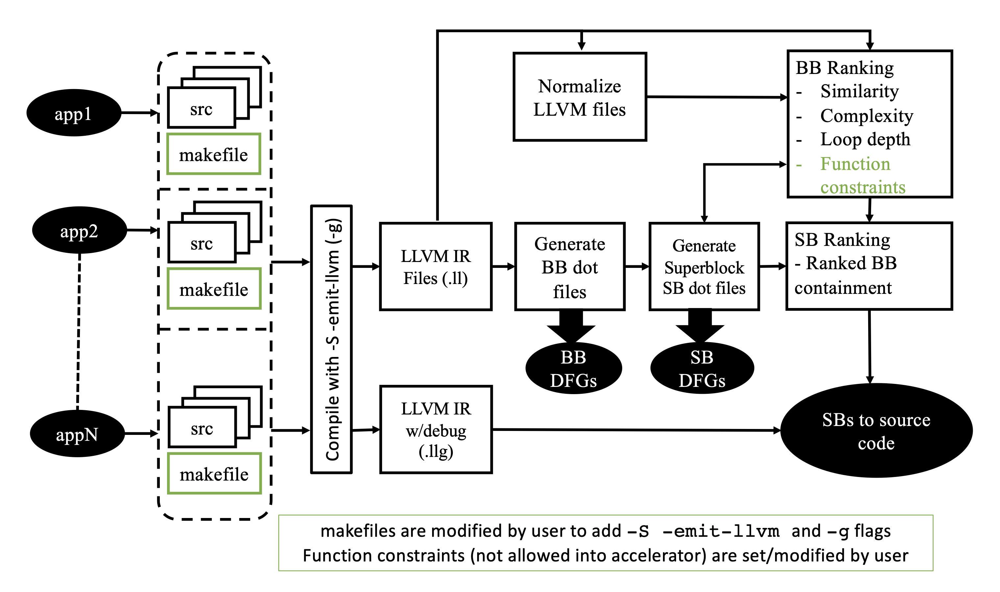

# Summary
Domain-specific accelerators (DSAs) [@Hennessy_Patterson_2019] are crucial in modern computer architecture as they enable highly efficient processing for specialized tasks, significantly improving performance and energy efficiency over general-purpose computing systems. Previous work [@limaye21_dosage] introduced the _Superblock_ (SB) as a new granularity for designing DSAs. The SB provides a middle ground to the existing extreme granularities of creating DSAs only from Basic Blocks (BBs) or whole functions. This paper describes an Open Source Software (OSS), called **D2**, that implements the SB approach and will enable researchers and developers in the DSA community to easily experiment with this new granularity towards finding an optimal solution to the DSA definition at hand. Our results show that the SB should be taken seriously as a candidate for creating DSAs.

# Statement of need
The DSA field currently offers few, if any, open-source automation tools. An important challenge in the design of DSAs is identifying what portions of a set of domain programs should be implemented in hardware (i.e., accelerated) to maximize the performance and energy benefits of the DSA. [@Hennessy_Patterson_2019] even argue for a new domain-specific language. The SB as a new DSA granularity offers real benefits for efficiently addressing this challenge. However, manually identifying these SBs can be prohibitively time-consuming and error-prone. This ground-up re-write as open source from conception hopes to bring the SB construct to the community at large. The **D2** tool provides an exhaustive list of SBs that can be simulated to determine the optimal size.

# Key aspects of D2
This is a follow-on work of [@limaye21_dosage] except re-engineered from the ground up, with special emphasis on making it open source. Additionally, the novel parts are:

 - user-controlled constraints
 - normalization of BBs
 - ranking at the BB level and then mapping the BB ranking onto SBs
 - maintaining a link back to the source so that the accelerators can be generated directly from the C source code rather than the LLVM intermediate representation (IR) files

# D2 Overview
**D2**, as depicted in \autoref{fig:d2flow}, is a tool that accepts a system\'s tree of source code. The user makes minor modifications to the makefiles to generate the required LLVM IR files. **D2** then evaluates the IR files to create a set of metadata files. It then identifies and ranks BBs and SBs as candidates for FPGA acceleration to produce an optimal set of accelerators for the system. The identified source lines are then given to a synthesis tool, such as Xilinx Vivato HLS [@unspecified21_vivado_hls] to produce an FPGA accelerator that is integrated back into the source code. The resulting system runs faster and more efficiently, potentially making the system viable on a resource-constrained target, which without the DSA would not be achievable.

## Target system model
The target is assumed to be a resource-constrained computing system in which the generated DSA can be integrated. For example, this could be a CPU+FPGA system, wherein the DSA is implemented on the FPGA, while the unaccelerated portions of the target workloads are run on the CPU. In this scenario, the FPGA should be addressable from the CPU such that the identified code that would normally be run by the CPU can be implemented on the FPGA and offloaded from the CPU without a significant bottleneck. This model is commonly found in resource-constrained computing devices where power constraints are a major concern, like human-implanted medical devices [@karageorgos20_hwsw_bci], for example.

## D2 implementation details
**D2** is a shell script that calls the individual programs written in both Python and C++ that process the LLVM files generated by the compiler.

### The search for superblocks
The control flow graph (CFG) is easily generated from the LLVM IR [@ref22_llvmwebsiteintro] files. We use Graphviz [@gansner17_graphviz] .dot file format to represent the CFG. The heart of the overall **D2** package is the sb` application (sb.cc) that reads the .dot file and iteratively identifies every SB in the CFG file. The `sb` application reads the CFG (.dot) file, within which each BB is represented as a node. Using the C++ Standard Template Library (STL) [@plauger00_c++stl], a map is constructed of each node with a vector of connected nodes. Once the graph is parsed into the map/tree, it recursively walks the tree identifying SBs by adding one adjacent node at a time and checking if the "One In, One Out" condition of an SB is satisfied. Once identified, the SB is added to a vector of SBs that is output and then ranked in a later stage.

### Identification of accelerator candidates
The key to achieving maximum acceleration is to choose areas of the software that are compute-bound. Further, if an accelerator can be used by multiple applications, the number of accelerators can be reduced. **D2** makes a concerted effort to identify common and frequently used code segments for acceleration.

### Constraints
One piece of metadata that is captured in the CFG file is all functions that the BB calls. These are labeled as constraints; in that if the BB is to be realized by an accelerator, any function called by the BB must also be incorporated by the accelerator. Thus, a BB that calls I/O functions, for example, is not a candidate for acceleration. During the **D2** processing of the source tree, the user is presented the list of constraints or functions called, if any, and given the option to remove any functions that could be realized by an accelerator. 
 
### Normalization of basic blocks
**D2** finds common accelerators through a process we call _normalization_. The normalization process strips the code of all data, both variables and constants, and replaces them with named registers. This process is greatly simplified via LLVM\'s existing Static Single Assignment (SSA) [@ref22_llvmwebsiteabs] strategy. Once normalized, BBs that perform the same set of instructions on a given set of data inputs are identified and consolidated to minimize redundancy.

### Ranking and selection
Ranking is accomplished by keeping metrics on each BB. Often, several SBs are subsets of a larger SB. While the largest SB often offers the best candidate for acceleration for a specific workload, a smaller SB that is common to multiple workloads may offer better overall acceleration to the entire system. **D2** makes it easier to iterate through the many possibilities to find the optimal solution for the target workloads.

### Back to the source
**D2** tracks the original C source files and lines of code that comprise each basic block. This allows us to use generic high-level synthesis tools like Xilinx Vivado [@unspecified21_vivado_hls] to produce the hardware description code (e.g., Verilog, SystemVerilog, VHDL) from the C source. This also simplifies modification of the original source.

# Conclusion
We believe there is a future in right-sizing the DSA and that the **D2** tool can provide valuable input to that end. Because there are very few OSS tools geared towards the automation of DSA identification, we hope that the **D2** tool will be utilized and expanded upon within the computer architecture community to become a valuable resource and additionally, make the concept of the SB more accessible to the community as a whole. 

# References
